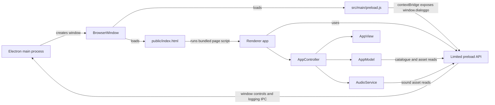

# Architecture

Dialoggo is an Electron desktop app. The main process owns the window and operating-system integrations; a preload bridge limits the APIs available to the renderer; the UI is organized around a model, controller, view, audio service, and focused domain modules.

## Process flow

## Responsibilities

| Area | Owns |
| --- | --- |
| `src/main/index.js` | Electron lifecycle, crash reporting, app metadata, and window startup. |
| `src/main/windows/` | BrowserWindow configuration, navigation restrictions, and external links. |
| `src/main/ipc/` | Window controls and renderer-to-main logging. |
| `src/main/preload.js` | The `window.dialoggo` API and bounded access to public assets. |
| `src/renderer/domain/` | Dialogue markup, line wrapping, numeric helpers, pitch, and speech cadence. |
| `src/renderer/models/AppModel.js` | Asset catalogue discovery, dialogue state, configuration, and model helpers. |
| `src/renderer/controllers/AppController.js` | Input handling, playback flow, settings, and coordination between model, view, and audio. |
| `src/renderer/views/AppView.js` | DOM and canvas updates, panels, sprites, layout, and animation. |
| `src/renderer/services/AudioService.js` | Audio loading, menu sounds, and dialogue playback. |
| `src/shared/` | Product metadata and security helpers shared by the Electron entry points. |
| `public/assets/` | Bundled characters, backgrounds, audio, fonts, styles, and configuration data. |

## Renderer startup and bundling

`public/index.html` loads `assets/js/app.js`. That page script is built from `src/renderer/index.js` and runs in the renderer's isolated main world. It creates the model, view, audio service, and controller flow. The preload does not import or execute renderer code.

`npm start` first builds an unminified development renderer bundle to the ignored `public/assets/js/app.js`, then launches Electron with the source main and preload files. `npm run build` copies the static `public/` tree and Webpack writes the production main, preload, and renderer bundles into `dist/`. The generated `dist/package.json` points Electron to the bundled main entry. `npm run start:dist` launches that bundle with the installed Electron runtime.

## Preload boundary

The BrowserWindow enables `contextIsolation` and disables `nodeIntegration`. Renderer code runs as a page script and receives only the API exposed with `contextBridge`: product runtime metadata, path helpers, existence and directory checks, JSON and bounded binary reads rooted under the packaged `public/` directory, safe `file:` URL creation, logging, and minimize/close controls.

Keep filesystem access inside the preload bridge. Validate paths against the public asset root, cap data reads, and avoid exposing general-purpose Node modules or unrestricted IPC to the UI. The preload currently uses Node APIs directly, so its Electron `sandbox` option is disabled; any future move to a sandboxed preload must first replace those direct filesystem operations with an appropriate constrained API. The renderer page itself has no Node integration.

The window denies new windows and routes only validated external HTTP(S) links to the operating system. Keep the Content Security Policy in `public/index.html` aligned with resources that the app actually loads.

## Product metadata and releases

`package.json` is the source of truth for version, product name, author, homepage, and license metadata. Shared Electron-specific values live in `src/shared/appMetadata.js`; the preload supplies the runtime version and product values to the UI. Update `package.json`, the lockfile root metadata, and `CHANGELOG.md` together for a release. Follow the [release checklist](RELEASE.md).

## Asset and license boundary

The build copies `public/` assets into `dist/`, so anything in that folder ships with the app. Review [NOTICE.md](../NOTICE.md) before adding, redistributing, or reusing media. The repository's MIT license applies to application code and does not grant rights to third-party artwork, sounds, fonts, or franchise marks.
